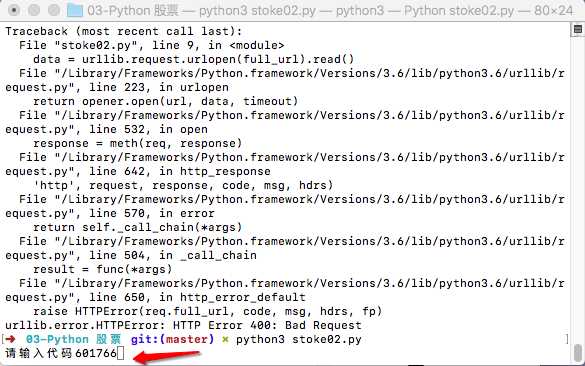
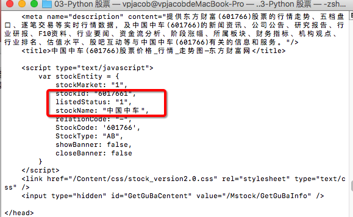
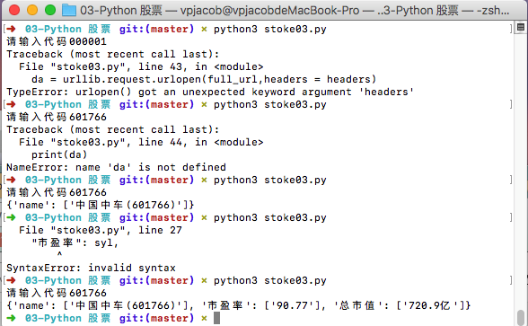
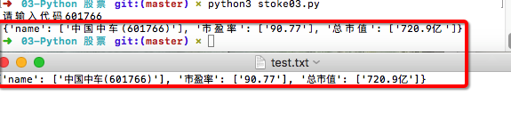

# PythonStock
##Day01 
直接运行得到601766的股票信息

##Day02 


- 让输入股票代码



- 输入后就得到601766的全部信息



##Day03 获取多个值

东方财富貌似有反爬虫机制，头几次请求很快，过后很慢，有的时候还会请求不下来。看来还得模拟手机，然后再将价格等等获取下来，如果本地有个文件就能遍历文件中的代码，批量获取信息了




调用write方法实现将数据存储下来

```
f=open('test.txt','w')
f.write(str(ite))
f.close()
```

